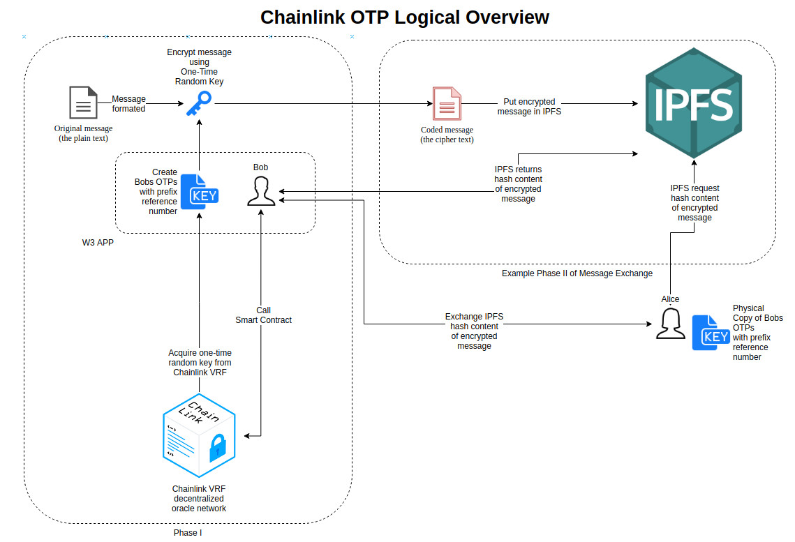

# Chainlink One Time Pad (OTP) Project

Chainlink Hackathon 2020: Building Universally Connected Smart Contracts

  

# Introduction

## Project Objectives

Team PrivKey is pleased to present this hackathon proposal project for one-time pads (OTP). OTP is an encryption technique in which each character of a message is combined with a character from a random key stream. Many OTP generators exist online, but they use pseudo random number generators in order to create the random key stream. To add to the security of generating a OTP, this project uses Chainlink VRF which allows the user to verify the randomness used in creating the OTP.

Included is a scope of work based on the project requirements for the workshop.

## Team Members

Kyle W. Santiago (KWS)\
Thomas Potter (TC)\
William K. Santiago (WKS)\
Thomas Greco (TG)

## Proposal Overview

### Phase I - Creating the OTP

1. Create random keys one-time pads (OTPs) that are indexed with prefix reference number using one-time random key provided by Chainlink VRF
2. Format the message
3. Encrypt the message using one-time random key from the OTP
4. Transfer encrypted message to other party

### Possible Phase II (Optional) - Sending the encrypted message to receiver over IPFS

1. Put encrypted message in IPFS
2. IPFS returns hash content of encrypted message
3. Exchange of IPFS hash to other party
4. Other party request hash content of encrypted message from IPFS
5. Decrypt message using one-time pad information that has been exchanged securely

  

