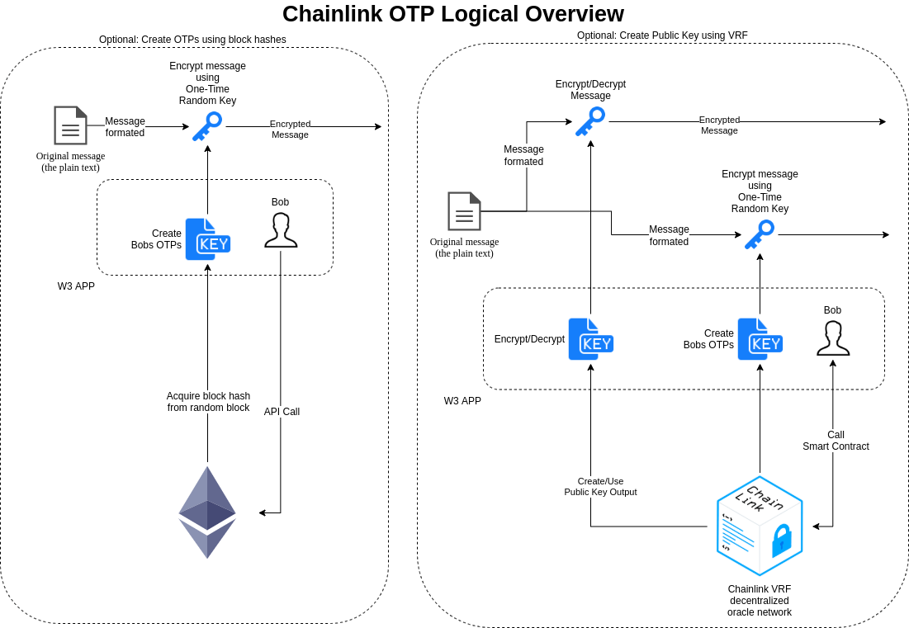

# Chainlink VRF One-Time-Pad (OTP)

<h3 align="center">Try it out <a href="https://chainlinkotp.privkey.io">here</a>!</h3>

  

## Project Objectives

One-Time-Pads (OTP) are an encryption technique in which each character of a message is combined with a character from a random key stream. Many OTP generators exist online, but they use pseudo random number generators in order to create the random key stream. To add to the security of generating OTPs, this project uses Chainlink VRF which allows the user to verify the randomness used in creating the OTPs.

## Creating the OTP

**1.** User requests for one-time pads (OTPs) to be generated

**2.** A VRF call is made requesting a random number which will then be use to create the OTPs

**3.** Encrypt the original message using the pads generated

**4.** Transfer encrypted message to the other party

Thanks!

Video demonstration: https://youtu.be/DToyi2CBTJk

  

